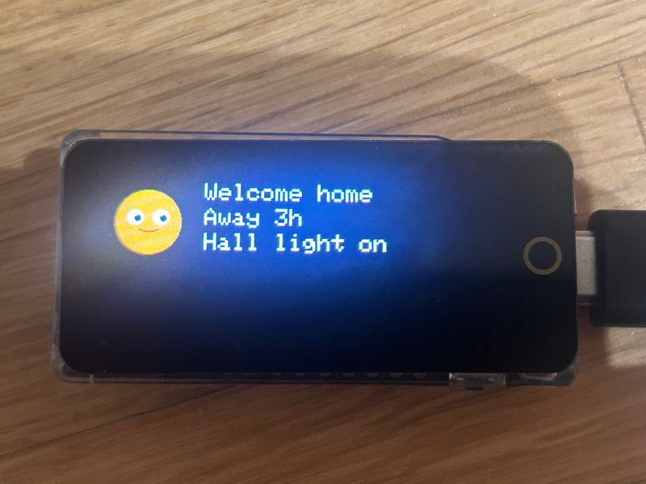
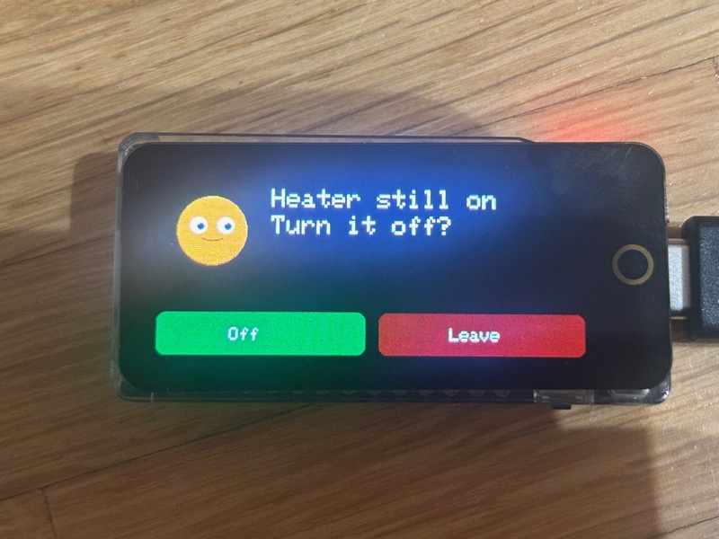
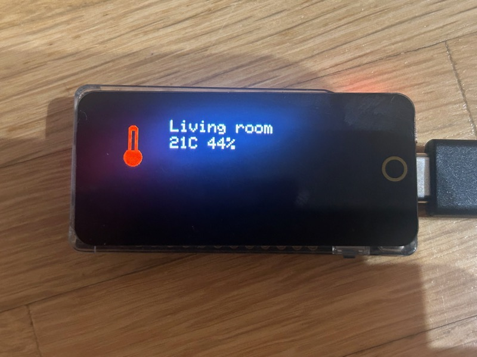
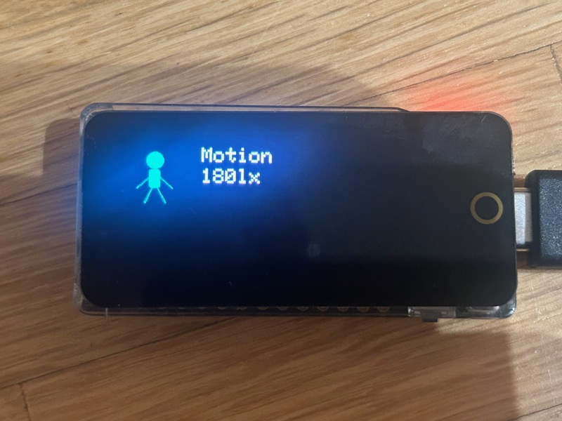
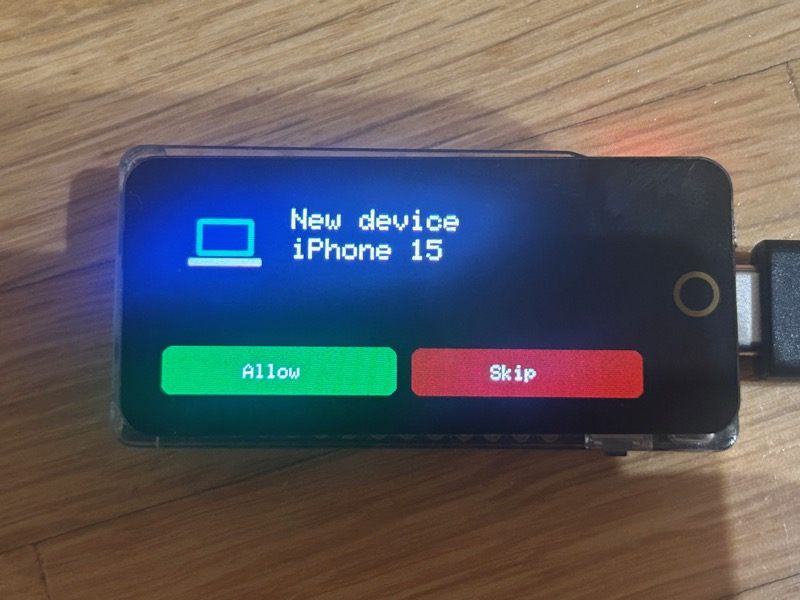
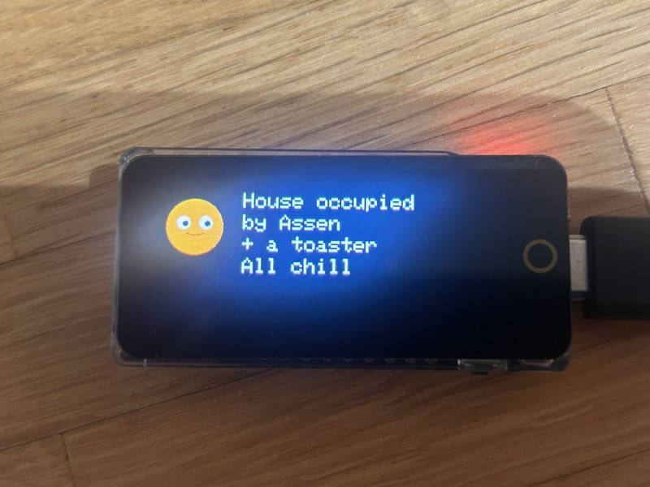
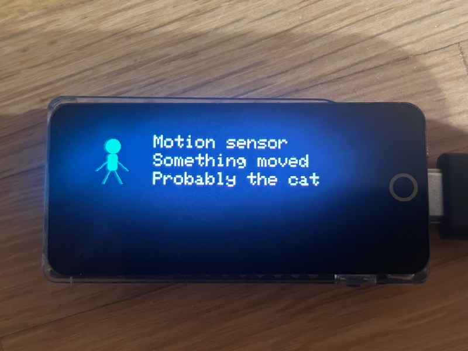
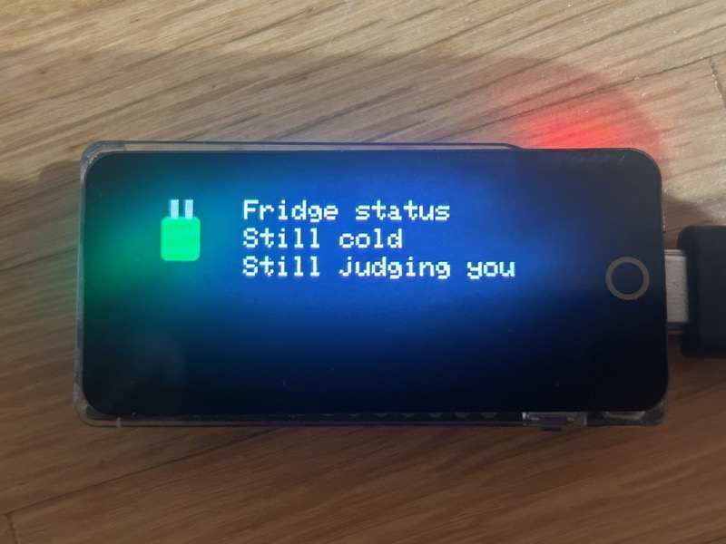
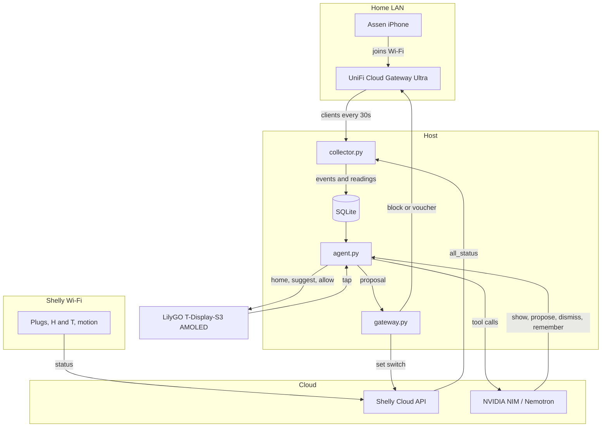

# House agent

A long-running agent for the home. It notices when you come back, turns on the light you want on, and says so on the T-Display-S3 AMOLED by the door. While you are out it keeps watching the network and the plugs. You do not start it for each visit.

UniFi is how it knows you are home: your phone leaves Wi-Fi and joins again after a real absence. 

Shelly plugs are the lights and appliances. 

NVIDIA is the session that decides. 

The S3 display is the screen. 

## Devices and services


|                                                           | What it is               | What the agent uses it for                               |
| --------------------------------------------------------- | ------------------------ | -------------------------------------------------------- |
| [UniFi](#unifi)                                           | The home network console | Who is home, and later a block or a guest voucher        |
| [Shelly](#shelly)                                         | The plugs and the lights | Turn the hall on, and ask before switching anything else |
| [NVIDIA NIM](#nvidia-nim)                                 | The model API            | Decide what to say and what to propose                   |
| [LilyGO T-Display-S3 AMOLED](#lilygo-t-display-s3-amoled) | The panel by the door    | The face, the greeting, and your tap                     |


How to fill in keys and device rows is under [Connect UniFi, Shelly, and NIM](#connect-unifi-shelly-and-nim).

### UniFi

UniFi is Ubiquiti's network controller, running on a console on the LAN (a Dream Machine, a Cloud Gateway, or the same software on your own host). This project uses the Network application's classic API under `/proxy/network/api/s/<site>/`, with an `X-API-KEY` header. The console certificate is often self-signed, and the client accepts that.

The collector reads the active client list (`stat/sta`): name, VLAN, access point, and traffic counters. A phone you mark as `presence_device` is how the house knows you left and came back. That address stays in the database. The panel shows your name, not the address. The gateway is the only process with the write key. It can block or unblock a client, and it can create a guest voucher. Quarantine is a block for now.

Keys are created on the console under Settings → Control Plane → Integrations. The read key stays with the collector. The write key stays with the gateway.

### Shelly

Shelly plugs and relays switch a light or an appliance and report power. This project uses the [Shelly Cloud Control API](https://shelly-api-docs.shelly.cloud/cloud-control-api/) when `SHELLY_CLOUD_HOST` and `SHELLY_CLOUD_AUTH_KEY` are set. One `device/all_status` read covers every plug. Switching goes through `v2/devices/api/set/switch`. The cloud allows about one call per second. The collector polls every 30 seconds, so that limit is comfortable.

The same plugs can still be controlled on the LAN. If the cloud variables are empty, the collector uses Gen2 local RPC, `Switch.GetStatus` and `Switch.Set`, at `http://<device-ip>/rpc/...`.

The collector only polls rows in the `shelly` table. `comfort_auto` may turn on when you arrive, with no tap. `never_switch_off` is never offered as something to turn off. Anything else can be proposed, and the display asks first. A Gen1 device (`/relay/0`) or a plug with a device password will not answer this client.

### NVIDIA NIM

[NVIDIA NIM](https://docs.nvidia.com/nim/) is NVIDIA's inference API. The agent uses the OpenAI-compatible chat completions endpoint, with tool calls. The hosted service is [build.nvidia.com](https://build.nvidia.com), at `https://integrate.api.nvidia.com/v1`. The default model is `nvidia/nemotron-3.5-lightning-30b-a3b`.

Each turn sends the pending events and a snapshot of the house. NIM may call `show`, `propose`, `dismiss`, or `remember`. A reply that is only text does not change a plug or the network. The API key is `NVIDIA_API_KEY`. A NIM container you run yourself is the same request with `NVIDIA_API_BASE` pointed at that server, and `NVIDIA_MODEL` set to the name it serves.

The face demos (`make face-greet`, `make face-ask`) do not call NIM. `make agent` does.

### LilyGO T-Display-S3 AMOLED

The face is a [LilyGO T-Display-S3 AMOLED](https://lilygo.cc/products/t-display-s3-amoled), the capacitive-touch 1.91 inch board. The glass is an RM67162 panel, 240×536, on an ESP32-S3R8 with 16 MB flash and 8 MB PSRAM. Touch is a CST816T. The board is plugged in over USB-C. The firmware in `firmware/display` draws it landscape, so lines run along the long edge.

With nothing to say, the screen is a waiting face that blinks. A message sits to the right of a smaller face, at most four lines of eighteen ASCII characters. In a question, a tap on the left half approves and a tap on the right half denies. The host protocol is one line at a time: `SHOW` out, `BTN` back, `HELLO` when the board boots.

`make display` builds that firmware with PlatformIO and flashes the board on `/dev/cu.usbmodem3101`. The agent then opens `/dev/tty.usbmodem3101` when that node exists, so the serial open does not reset the ESP32. `make face-idle`, `make face-greet`, and `make face-ask` drive the panel with no UniFi, Shelly, or NIM. `make mock` is the same screen in a browser. 

## What you see

The panel is 240×536, drawn landscape so words run along the long edge. With nothing to say it shows a waiting face. Messages are at most four lines, eighteen ASCII characters each.

Coming home:

```
Welcome home
Away 3h
Hall light on
```



A question. The left half of the panel approves, the right half denies:

```
Heater still on
Turn it off?
```



A few more cards from the display

| | | |
|---|---|---|
|  |  |  |
| Living room, 21C 44% | Motion, 180lx | A new iPhone 15 on the network |
|  |  |  |
| House occupied by Assen + a toaster | Something moved, probably the cat | The fridge, still judging you |

## Run it

```bash
python3 -m venv .venv
.venv/bin/pip install -r requirements.txt
cp .env.example .env
```

What to put in `.env` is in [Connect UniFi, Shelly, and NIM](#connect-unifi-shelly-and-nim). MQTT passwords are only for the browser simulator.

```bash
make init-db
make collector   # UniFi + Shelly poll, writes events
make agent       # the session, and the USB display
```

Flash the panel once. PlatformIO is installed in `.venv` (on a fresh checkout: `.venv/bin/pip install platformio`). Leave the board plugged in:

```bash
make display
```

The firmware brings the panel up, prints `HELLO T-Display-S3-AMOLED 536 240` on USB, and then takes `SHOW` lines from the agent. A tap on the left half approves. A tap on the right half denies. The agent opens `/dev/tty.usbmodem3101` when that node exists, so the port open does not reset the board.

`make test` runs the host tests without UniFi, NVIDIA, or the panel. `make mock` is the browser stand-in for the same screen when the board is not attached.

## Connect UniFi, Shelly, and NIM

The host has to reach the UniFi console and the plugs on the LAN, and it needs outbound HTTPS for NIM. The display stays on USB. MQTT is not part of this.

### UniFi

On the console: Settings → Control Plane → Integrations. Create an API key. The read key lists clients. The write key is what a later block or unblock uses.

```bash
UNIFI_URL=https://192.168.1.1
UNIFI_SITE=default
UNIFI_READ_KEY=
UNIFI_WRITE_KEY=
```

`UNIFI_SITE` stays `default` unless the console shows another site name. A self-signed console certificate is accepted.

The collector records every client it sees. Coming home only counts for a phone you have marked, and only after it has been gone for `ARRIVAL_ABSENCE_MIN` (default 20 minutes). Run the collector once, then:

```sql
INSERT INTO people(id, name) VALUES(1, 'Assen');

UPDATE devices
SET person_id = 1, presence_device = 1, trusted = 1, friendly_name = 'Phone'
WHERE mac = 'aa:bb:cc:dd:ee:ff';
```


### Shelly

In the Shelly app open **User settings → Authorization cloud key**. Copy the server URI and the key into `.env`. Do not put the key in chat.

```bash
SHELLY_CLOUD_HOST=https://shelly-XX-eu.shelly.cloud
SHELLY_CLOUD_AUTH_KEY=
```

The key changes if you change the Shelly account password. Whoever has it can switch every device on that account.

Each plug's id is under **Device → Settings → Device information → Device ID**. That id is `device_id` in the database. Channel `0` is the first output. `ip` can stay empty when the cloud key is set.

```sql
INSERT INTO shelly(device_id, name, ip, kind, comfort_auto, never_switch_off)
VALUES('b48a0a1cd978', 'Hall light', '', 'switch', 1, 0);

INSERT INTO shelly(device_id, name, ip, kind, comfort_auto, never_switch_off, idle_w)
VALUES('c59b1b2de089', 'Fridge', '', 'switch', 0, 1, 40);
```


| Column                 | Meaning                                                                                    |
| ---------------------- | ------------------------------------------------------------------------------------------ |
| `device_id`            | Device ID from the Shelly app. This is what the cloud API switches                         |
| `ip`                   | LAN address. Leave empty when the cloud key is set                                         |
| `comfort_auto = 1`     | May switch on when you arrive, with no tap. Use this for the hall light                    |
| `never_switch_off = 1` | Never offered as something to turn off. Use this for the fridge                            |
| `idle_w`               | Power that counts as idle. A house-empty alert needs more than `max(20, 5 * idle_w)` watts |


Leave both flags at `0` for a heater: the agent can ask before switching it off, and it will not turn on by itself.

### NIM

Create a key at [build.nvidia.com](https://build.nvidia.com).

```bash
NVIDIA_API_KEY=nvapi-...
NVIDIA_MODEL=nvidia/nemotron-3.5-lightning-30b-a3b
NVIDIA_API_BASE=https://integrate.api.nvidia.com/v1
```

A NIM you run yourself uses the same API. Point `NVIDIA_API_BASE` at it, for example `http://127.0.0.1:8000/v1`, and set `NVIDIA_MODEL` to the name that container serves. The model has to accept tool calls.

Start the collector and the agent after the keys and the Shelly rows are in place:

```bash
make collector
make agent
```


## Architecture

The collector and the agent stay up on the host — a VM, a Pi, or a spare machine. The agent calls the gateway in-process. Arrival greetings are built from the database. Other decisions go to NVIDIA NIM. The panel is a deck of cards on USB: swipe changes the card, a tap answers the one in front.




| Piece                      | Job                                                                                        |
| -------------------------- | ------------------------------------------------------------------------------------------ |
| UniFi Cloud Gateway Ultra  | Who is on Wi-Fi. The iPhone is the presence device                                         |
| Shelly Cloud API           | Temperature, humidity, motion, and plug power. Switching goes back through the same API    |
| `host/collector.py`        | Polls UniFi and Shelly every 30 seconds and writes SQLite                                  |
| SQLite                     | Devices, sensor readings, events, notes, proposals, audit                                  |
| `host/agent.py`            | Arrival greeting, suggestion cards, and NIM for everything else                            |
| NVIDIA NIM                 | Nemotron at `integrate.api.nvidia.com`. Tools only: a text reply does not change the house |
| `host/gateway.py`          | Tiers, HMAC, expiry, and the only writes to UniFi and Shelly                               |
| LilyGO T-Display-S3 AMOLED | Cards over USB. Swipe moves. A tap answers                                                 |


### Coming home

UniFi sees the phone after it has been gone for `ARRIVAL_ABSENCE_MIN`. The collector writes an arrival. The agent puts **Hello Assen**, the living-room temperature, and motion on the first card. It stays until you tap. Swipe left for suggestions, such as a sensor or plug that is offline. A comfort plug, if one is marked, is switched by the gateway with no tap.

### Empty house

Every presence device is gone, and a plug that may be switched off is drawing real power. The collector writes `shelly_power`. NIM proposes switching it off, and the panel asks. A tap is signed. The gateway runs it only while the signature is valid and the proposal has not expired. A second tap on the same proposal is ignored. The fridge is `never_switch_off`, so a proposal to turn it off is rejected and never shown as a question.

### Unknown client

A client the house has not enrolled becomes `new_client`. The panel gets an Allow card: tap Allow to trust it, or Skip to leave it unknown. A block is still a separate secure proposal. UniFi does not change until that proposal is approved.


| Tier    | Runs when                                                     |
| ------- | ------------------------------------------------------------- |
| comfort | Hall light on, as soon as NIM proposes it                     |
| approve | Other Shelly changes and guest vouchers, after a tap          |
| secure  | Block, unblock, quarantine, after a tap                       |
| reject  | Unknown actions, or switching off a `never_switch_off` device |


Mosquitto is the browser simulator, and a later S3 build that sits on Wi-Fi instead of this cable. The attached panel does not need it. `make face-idle`, `make face-greet`, and `make face-ask` drive that panel with no UniFi, Shelly, or NIM.

Next steps: 

- Moving the agent to a Raspberry Pi and the panel onto Wi-Fi  (docs/raspberry-pi.md)

