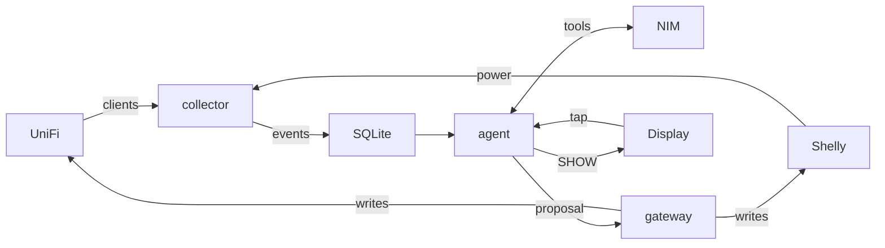

# House agent

A long-running agent for the home. It notices when you come back, turns on the light you want on, and says so on the T-Display-S3 AMOLED by the door. While you are out it keeps watching the network and the plugs. You do not start it for each visit.

UniFi is how it knows you are home: your phone leaves Wi-Fi and joins again after a real absence. Shelly plugs are the lights and appliances. NVIDIA is the session that decides. The S3, already plugged into this machine, is the only screen it has. A tap on that screen is the answer when something is not obvious.

Comfort is immediate. The hall light is marked so it may turn on without a tap. The fridge is marked so it is never offered as something to switch off. A heater left on, or a client the house has not seen before, is a question on the display. Approve and deny are signed, expire, and are written to the audit log. The model does not hold the UniFi or Shelly credentials. It proposes. The gateway is the only code that changes the network.

## What you see

The panel is 240×536, drawn landscape so words run along the long edge. With nothing to say it shows a waiting face. Messages are at most four lines, eighteen ASCII characters each.

Coming home:

```
Welcome home
Away 3h
Hall light on
```

A question. The left half of the panel approves, the right half denies:

```
Heater still on
Turn it off?
```

The idle screen stays up between those moments. Every fifteen minutes, if nothing else happened, the agent looks again and rewrites it only when it should change. Notes it saves are still there the next day.

## Run it

```bash
python3 -m venv .venv
.venv/bin/pip install -r requirements.txt
cp .env.example .env
```

What to put in `.env` is in [Connect UniFi, Shelly, and NIM](#connect-unifi-shelly-and-nim). MQTT passwords are only for the browser simulator.

```bash
make init-db
make collector   # UniFi + Shelly poll, writes events
make agent       # the session, and the USB display
```

Flash the panel once. PlatformIO is installed in `.venv` (on a fresh checkout: `.venv/bin/pip install platformio`). Leave the board plugged in:

```bash
make display
```

The firmware brings the panel up, prints `HELLO T-Display-S3-AMOLED 536 240` on USB, and then takes `SHOW` lines from the agent. A tap on the left half approves. A tap on the right half denies. The agent opens `/dev/tty.usbmodem3101` when that node exists, so the port open does not reset the board.

`make test` runs the host tests without UniFi, NVIDIA, or the panel. `make mock` is the browser stand-in for the same screen when the board is not attached.

## Connect UniFi, Shelly, and NIM

This machine has to reach the UniFi console and the plugs on the LAN, and it needs outbound HTTPS for NIM. The display stays on USB. MQTT is not part of this.

### UniFi

On the console: Settings → Control Plane → Integrations. Create an API key. The read key lists clients. The write key is what a later block or unblock uses.

```bash
UNIFI_URL=https://192.168.1.1
UNIFI_SITE=default
UNIFI_READ_KEY=
UNIFI_WRITE_KEY=
```

`UNIFI_SITE` stays `default` unless the console shows another site name. A self-signed console certificate is accepted.

The collector records every client it sees. Coming home only counts for a phone you have marked, and only after it has been gone for `ARRIVAL_ABSENCE_MIN` (default 20 minutes). Run the collector once, then:

```sql
INSERT INTO people(id, name) VALUES(1, 'Assen');

UPDATE devices
SET person_id = 1, presence_device = 1, trusted = 1, friendly_name = 'Phone'
WHERE mac = 'aa:bb:cc:dd:ee:ff';
```

### Shelly

Gen2 or newer (Plus, Pro, or Gen3), on the same LAN, answering local HTTP RPC with no password. The client calls `http://<ip>/rpc/Switch.GetStatus` and `Switch.Set`. It does not discover plugs. Each one is a row you insert.

Find the address in the Shelly app or on the router, then check it from this machine. Channel `0` is the first switch. A working plug returns JSON with `output` and `apower`:

```bash
curl -s "http://192.168.1.50/rpc/Switch.GetStatus?id=0"
```

If that curl does not answer, the collector will log `shelly_unreachable` and skip it. A plug with RPC authentication turned on will not answer this client.

```sql
INSERT INTO shelly(device_id, name, ip, kind, comfort_auto, never_switch_off)
VALUES('hall', 'Hall light', '192.168.1.50', 'switch', 1, 0);

INSERT INTO shelly(device_id, name, ip, kind, comfort_auto, never_switch_off, idle_w)
VALUES('fridge', 'Fridge', '192.168.1.51', 'switch', 0, 1, 40);
```

| Column | Meaning |
|---|---|
| `ip` | LAN address of that plug |
| `comfort_auto = 1` | May switch on when you arrive, with no tap. Use this for the hall light |
| `never_switch_off = 1` | Never offered as something to turn off. Use this for the fridge |
| `idle_w` | Power that counts as idle. A house-empty alert needs more than `max(20, 5 * idle_w)` watts |

Leave both flags at `0` for a heater: the agent can ask before switching it off, and it will not turn on by itself.

### NIM

Create a key at [build.nvidia.com](https://build.nvidia.com).

```bash
NVIDIA_API_KEY=nvapi-...
NVIDIA_MODEL=nvidia/nemotron-3.5-lightning-30b-a3b
NVIDIA_API_BASE=https://integrate.api.nvidia.com/v1
```

A NIM you run yourself uses the same API. Point `NVIDIA_API_BASE` at it, for example `http://127.0.0.1:8000/v1`, and set `NVIDIA_MODEL` to the name that container serves. The model has to accept tool calls.

Start the collector and the agent after the keys and the Shelly rows are in place:

```bash
make collector
make agent
```

## Architecture

Two processes stay up: the collector and the agent. The agent calls the gateway in-process. NVIDIA NIM is a chat completion with tools. The display is USB serial, not a second brain.



| Piece | Job |
|---|---|
| `host/collector.py` | Polls UniFi and Shelly every 30 seconds and writes events |
| `host/agent.py` | Claims events, calls NIM, drives the USB display |
| `host/gateway.py` | Tiers, HMAC, expiry, and the only writes |
| SQLite | Devices, events, notes, proposals, audit |
| NVIDIA NIM | `show`, `propose`, `dismiss`, `remember` |
| `firmware/display` | Landscape face on the T-Display-S3 |

Hosted NIM is `https://integrate.api.nvidia.com/v1`. A NIM you run yourself is the same API: set `NVIDIA_API_BASE` to that server. The model has to accept tool calls. A plain text reply does not change the house.

### Coming home

UniFi sees the phone after it has been gone for `ARRIVAL_ABSENCE_MIN` (default 20). The collector writes an arrival. The agent claims it and asks NIM. NIM proposes the hall light. That Shelly is `comfort_auto`, so the gateway switches it on with no tap. The display shows a short greeting beside the face.

### Empty house

Every presence device is gone, and a plug that may be switched off is drawing real power. The collector writes `shelly_power`. NIM proposes switching it off, and the panel asks. A tap is signed. The gateway runs it only while the signature is valid and the proposal has not expired. A second tap on the same proposal is ignored. The fridge is `never_switch_off`, so a proposal to turn it off is rejected and never shown as a question.

### Unknown client

A client the house has not enrolled becomes `new_client`. NIM may mention it with `show`, or propose a block. Block, unblock, and quarantine are the secure tier: UniFi does not change until the display approves.

| Tier | Runs when |
|---|---|
| comfort | Hall light on, as soon as NIM proposes it |
| approve | Other Shelly changes and guest vouchers, after a tap |
| secure | Block, unblock, quarantine, after a tap |
| reject | Unknown actions, or switching off a `never_switch_off` device |

Mosquitto is the browser simulator, and a later S3 build that sits on Wi-Fi instead of this cable. The attached panel does not need it. `make face-idle`, `make face-greet`, and `make face-ask` drive that panel with no UniFi, Shelly, or NIM.
